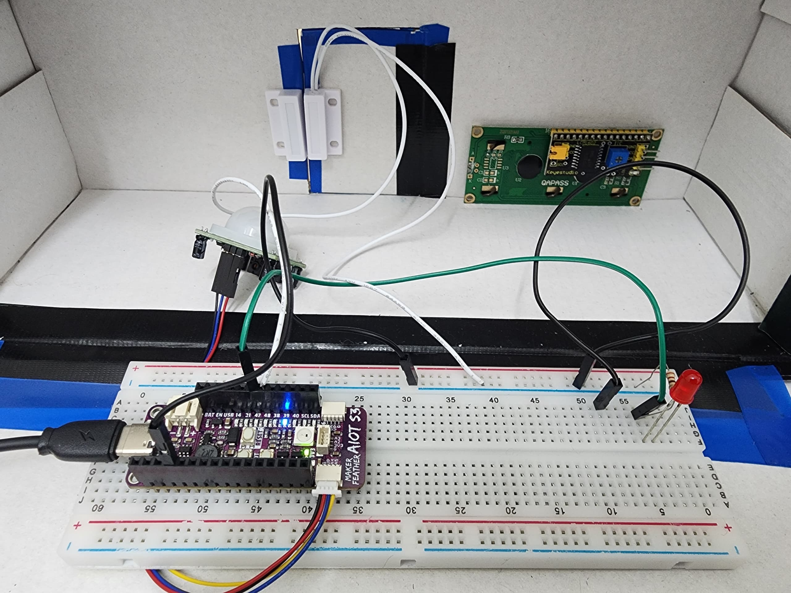
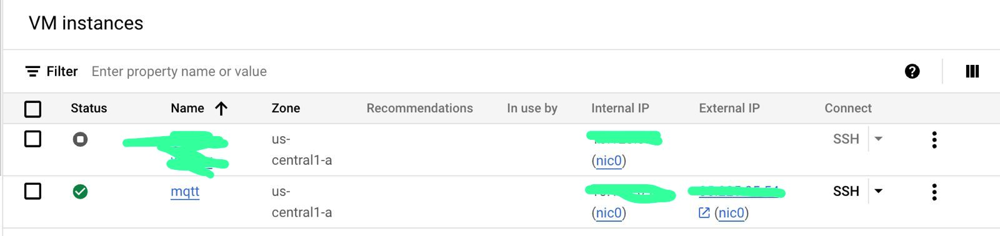
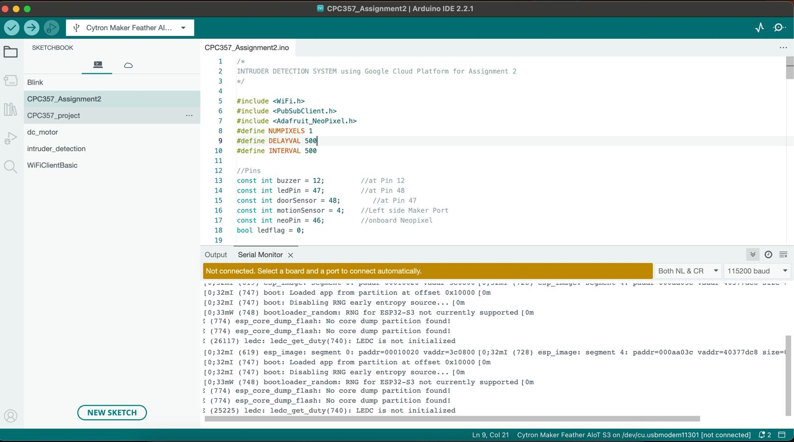
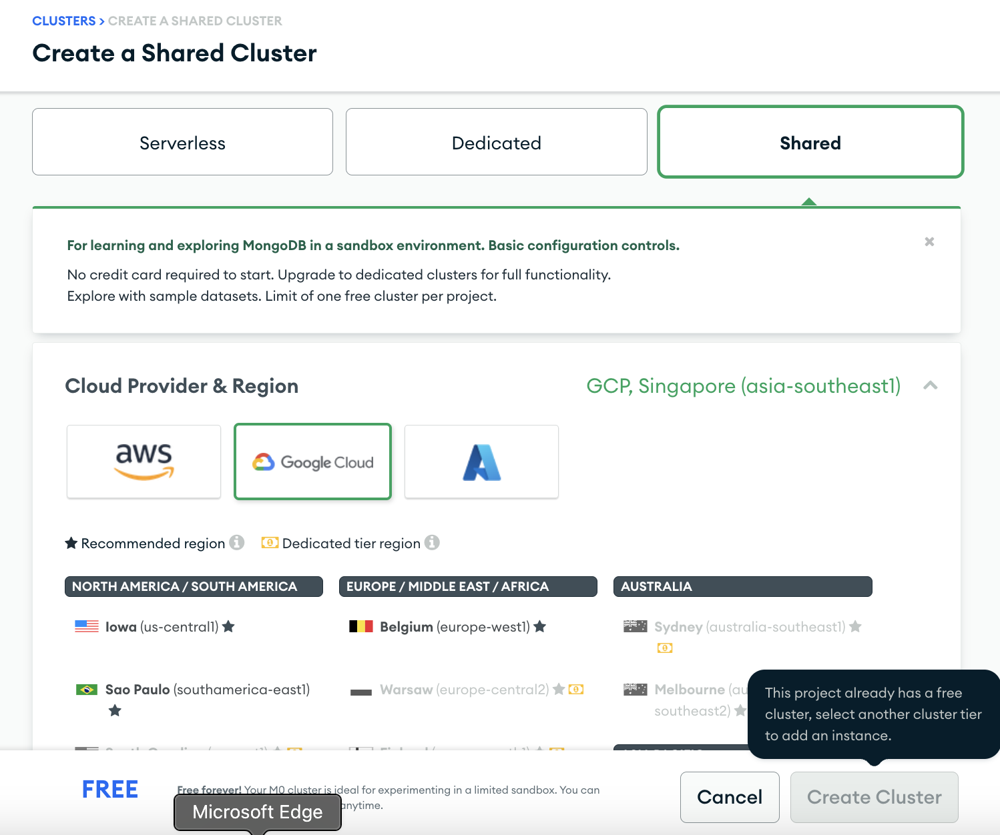
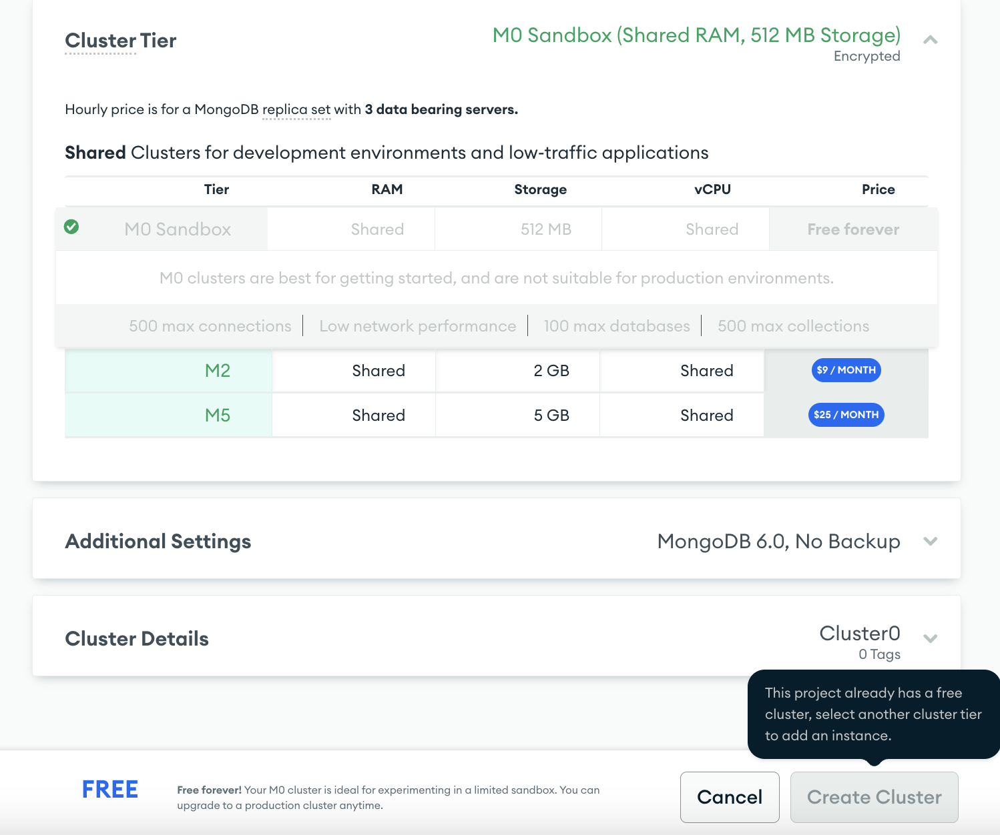
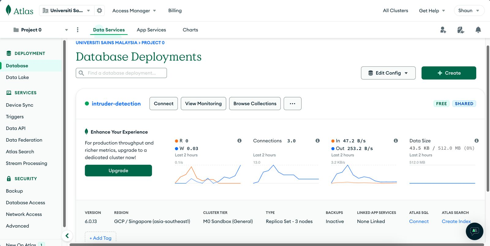
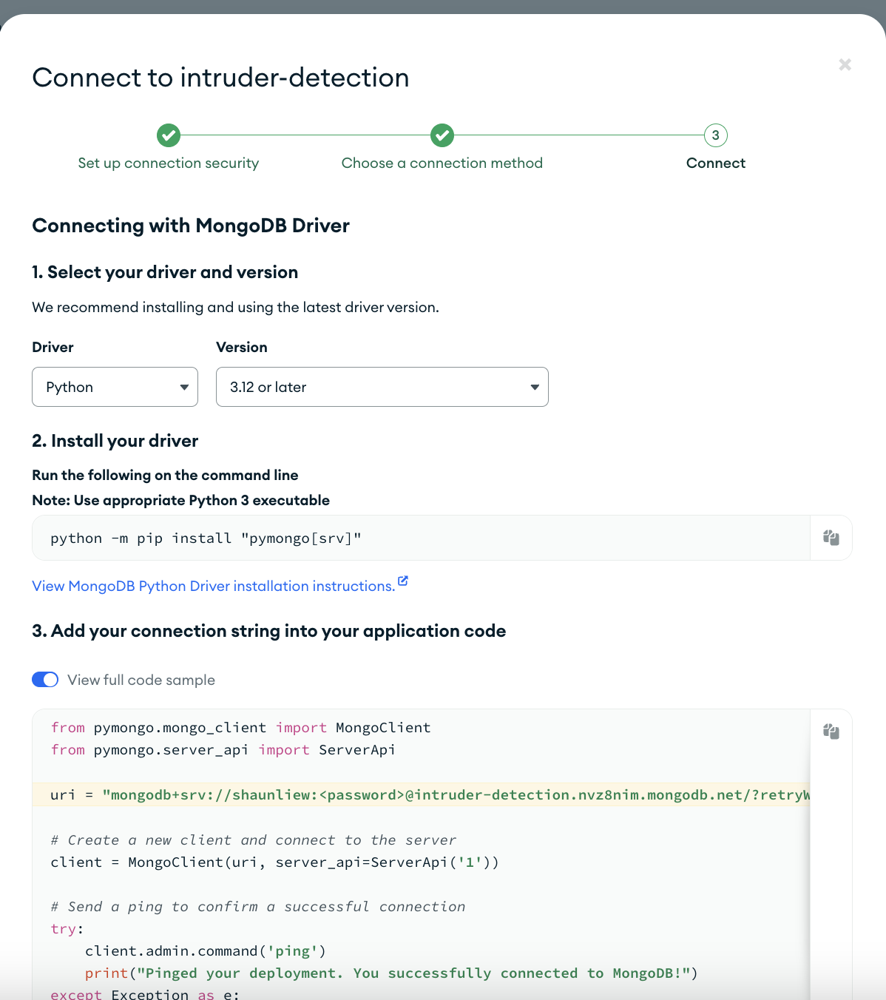
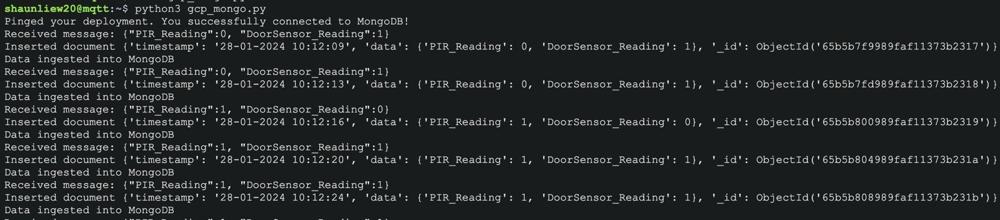
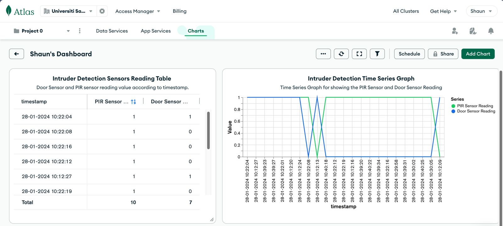

# Intruder Alarm System

This project is for CPC357 Assignment. This intruder alarm system will trigger the buzzer and LED whenever the PIR motion sensor detected motion or the door sensor detect the door opens. On top of that, it will send the sensor data to GCP via MQTT and store the data into MongoDB Atlas Cloud Database. We can visualize the detection result in MongoDB Atlas using dashboard.

## Team members

- Shaun Liew Xin Hong 154746
- Liew Hui Lek 151496

## Technology Deployed

- Maker Feather AIoT S3 board
- Buzzer
- LED
- PIR Motion Sensor
- MC-38 Door Magnetic Sensor Switch
- Arduino Code
- Google Cloud Platform
- MongoDB Atlas

## Description 

The intruder alarm system utilizes a passive infrared (PIR) motion sensor and MC-38 door magnetic sensor switch that are interfaced with the Maker Feather AIoT S3 board to detect intrusions. 

When the PIR sensor senses movement or the door sensor detects an opening, it sends the data to the Maker Feather AIoT S3 board. The board will then activate the buzzer, which sounds an alarm and blinks the LED as a visual alert signal. 

To communicate with the cloud, the Maker Feather AIoT S3 uses the MQTT protocol to publish the intrusion event data to the Google Cloud Platform. Google Cloud enables the collection of intrusion event data and stores it in a MongoDB NoSQL cloud database for long-term storage. Then, MongoDB Atlas will access the intrusion events data from the MongoDB cloud database to visualise the stored intrusion events data using the Atlas dashboard.

## Hardware Setup

Setup the Hardware as shown in the image below.


## Software Setup

### Google Cloud VM Setup

1. Create a Google Cloud VM



2. SSH into the VM and run the code below to install MQTT.

```
sudo apt-get update
sudo apt-get upgrade
sudo apt-get install mosquitto
sudo apt-get install mosquito-clients
```

3. Create a firewall rule to allow traffic on port 1883.
4. Add the firewall rule to the VM instance's configuration.
   - Edit the default-allow-internal rule to allow ingress traffic on TCP port 1883. 
  
### Arduino Code Setup

Download the `intruder_detection.ino` and put into your Arduino IDE and change the `Pin`, `MQTT Server`, `Wifi` setup accordingly. 

Run the code as shown as below. Make sure your device is connected to your computer to upload the code. 


### MongoDB Atlas
In order to persist the sensor data sent from the device, we need to store it into MongoDB Atlas database instead of localhost.

1. Create a [MongoDB Atlas Account](https://www.mongodb.com/cloud/atlas/lp/try4?utm_source=bing&utm_campaign=search_bs_pl_evergreen_atlas_core_prosp-brand_gic-null_apac-my_ps-all_desktop_eng_lead&utm_term=mongodb%20atlas&utm_medium=cpc_paid_search&utm_ad=e&utm_ad_campaign_id=415204527&adgroup=1221557888421693&msclkid=cf8570eb84ee15b952dd155e58cf8328)
   - make sure you use the same email as your GCP account. 

2. Create a MongoDB Atlas Cluster as shown as below.





3. After the cluster is created succesfully, get the connection string by clicking the connect button on the home page as shown below. Make sure you change the connection string `<password>` to your own password.

```
uri = "mongodb+srv:/shaunliew:<password>@intruder-detection.nvz8nim.mongodb.net/?retryWrites=true&w=majority"
``` 





### Data Ingestion Python script

1. go to the `gcp_ingest_data_mongo.py` and change the mongoDB Atlas `url connection string` and `mqtt_broker_address` accordingly.

2. SSH to the virtual machine created in GCP and copy the `gcp_ingest_data_mongo.py` and paste it into the VM using nano command. After you nano into the python file, copy paste the script press `ctrl+X` to save it.

```
nano gcp_ingest_data_mongo.py
```

3. Install the python libraries needed in your VM using the command below.

```
sudo apt install python3-pip
pip install paho-mqtt
sudo apt-get install -y mongodb
pip install pymongo
```

4. Run the data ingestion python script.

```
python3 gcp_ingest_data_mongo.py
```

5. Play around with your sensor so that it can send the data to the MongoDB as shown below.



### Visualize the detection result using MongoDB Atlas

Now you have successfully ingest the sensor data into MongoDB. You can check your detection result in your `MongoDB Atlas Charts Dashboard`. You can create different pattern of graph according to your preferences.



## Final Result
You may view the final result from the youtube link below.

[Intruder Alarm System Demo Youtube Video](https://youtu.be/uILskmLR4WM)
